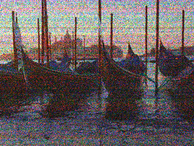
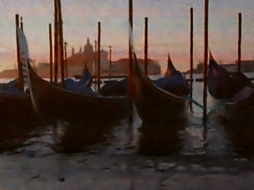
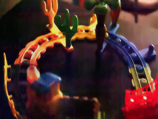
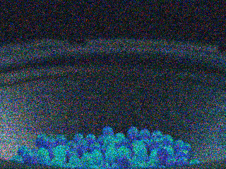
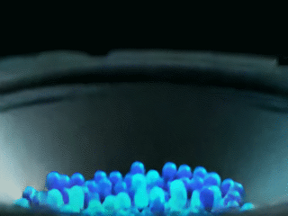
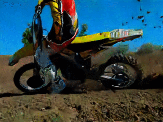

# Enhancing Low Light Videos by Exploring High Sensitivity Camera Noise

Wei Wang,  Xin Chen,  Cheng Yang,  Xiang Li,  [Xuemei Hu](<https://xuemei-hu.github.io/>) and [Tao Yue](<https://yuetao-nju-ece.github.io/>) 

Enhancing Low Light Videos by Exploring High Sensitivity Camera Noise(ICCV), 2019

## Abstract

Enhancing low light videos, which consists of denoising and brightness adjustment, is an intriguing but knotty problem. Under low light condition, due to high sensitivity camera setting, commonly negligible noises become obvious and severely deteriorate the captured videos. To recover high quality videos, a mass of image/video denoising/enhancing algorithms are proposed, most of which follow a set of simple assumptions about the statistic characters of camera noise, e.g., independent and identically distributed (i.i.d.), white, additive, Gaussian, Poisson or mixture noises. However, the practical noise under high sensitivity setting in real captured videos is complex and inaccurate to model with these assumptions.
In this paper, we explore the physical origins of the practical high sensitivity noise in digital cameras, model them mathematically, and propose to enhance the low light videos based on the noise model by using an LSTM-based neural network. Specifically, we generate the training data with the proposed noise model and train the network with the dark noisy video as input and clear-bright video as output.  Extensive comparisons on both synthetic and real captured low light videos with the state-of-the-art methods are conducted to demonstrate the effectivenesss of the proposed method.

## Comparisons with other methods 

|            Noise            |            VBM4D            |            TOFlow            |        Our method         |
| :-------------------------: | :-------------------------: | :--------------------------: | :-----------------------: |
|     |     |     |     |
|  |  |  |  |
|   |   |   |   |

## More results with our method

|                 Input                  |             Our results              |
| :------------------------------------: | :----------------------------------: |
|     |     |
|    |    |
|     |     |
|     |     |
|  |  |
|     |     |

